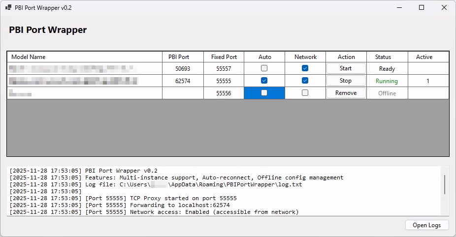

[](https://github.com/pschaer/PBIPortWrapper/releases/latest)
[](https://opensource.org/licenses/MIT)

# PBI Port Wrapper

A TCP port forwarding proxy for Power BI Desktop that provides stable port access for external tools like Excel, DAX Studio, and Tabular Editor.

## 🎯 Problem Solved

Power BI Desktop uses dynamic ports that change with each session, making it difficult to:
- Connect from external tools consistently
- Share connection information with team members
- Automate workflows that depend on local Power BI models

**PBI Port Wrapper** solves this by providing a stable, fixed port that forwards connections to the configured Power BI Desktop instance.

## ✨ Features

- ✅ **Stable Port Forwarding** - Fixed port number (default: 55555) that doesn't change
- ✅ **Automatic Detection** - Finds running Power BI Desktop instances automatically
- ✅ **Multi-Instance Support** - Forward multiple Power BI instances simultaneously
- ✅ **Per-Instance Configuration** - Set fixed ports and network access per model
- ✅ **Auto-Connect** - Automatically start forwarding for configured instances
- ✅ **Local Connections** - Full Windows Authentication support
- ✅ **Remote Connections** - Network access with explicit credentials
- ✅ **Activity Logging** - Real-time connection monitoring and file logging
- ✅ **Simple UI** - Easy-to-use interface with minimal configuration


## 📋 Requirements

- Windows 10/11
- Power BI Desktop (any version)

**Note:** No additional software installation required - .NET runtime is included.


## 🚀 Quick Start

1. **Download** the latest release
2. **Extract** the ZIP file
3. **Run** ```PBIPortWrapper.exe```
4. **Start Power BI Desktop** instances with your models
5. **Instances appear automatically** in the data grid as they're detected
6. **Configure each instance** - assign fixed port, enable auto-connect if desired
7. **Click "Start"** to begin forwarding for each instance
8. **Connect** from your tools using the configured ports


## 📸 Interface



*DataGrid interface showing multiple Power BI instances with individual port mappings, auto-connect settings, and network access controls*


## 🔌 Connecting from Tools

### Excel (Same Computer)
1. Data → Get Data → From Database → From Analysis Services
2. Server name: ```localhost:55555```
3. Authentication: Use Windows Authentication
4. Select your database

### Excel (Remote Computer)
1. Data → Get Data → From Database → From Analysis Services
2. Server name: ```[your-ip]:55555```
3. Authentication: Use the following User Name and Password
   - Username: Your Microsoft Account email or DOMAIN\username
   - Password: Your password
4. Select your database

### DAX Studio
1. Connect → Connection String
2. Enter: ```Data Source=localhost:55555```
3. Click Connect


## ⚙️ Configuration

- **Fixed Port**: The fixed port to listen on for the instance (default: 55555)
- **Auto** - Automatically start forwarding when instance is detected
- **Allow Network Access**: Enable connections from other computers
  - ⚠️ Requires Windows Firewall configuration
  - Remote clients must use explicit credentials

### Firewall Configuration

To allow remote connections, run this PowerShell command as Administrator (adapt `-LocalPort` to your configuration):

```powershell
New-NetFirewallRule -DisplayName "PBI Port Wrapper" -Direction Inbound -LocalPort 55555 -Protocol TCP -Action Allow
```


## 📁 File Locations

- **Configuration**: ```%APPDATA%\PBIPortWrapper\config.json```
- **Logs**: ```%APPDATA%\PBIPortWrapper\log.txt```


## 🐛 Known Limitations (v0.2)

- ⚠️ **Database name changes** when Power BI Desktop restarts - requires reconnection
- ⚠️ **Network access setup** - manual Windows Firewall configuration required


## 🗺️ Roadmap

### v0.2 ✅ (Released)
- Multi-instance support
- Per-instance port mapping, network access control and auto-connect
- DataGrid-based UI

### v0.x (Planned)
- **External Tool Integration** - Register as Power BI Desktop External Tool for one-click launch

### v1.0 (Vision)
- Full XMLA protocol proxy with database name abstraction
- Transparent remote authentication


### Future Considerations
- Improvements to installation
- System tray integration with background operation
- Auto-start with Windows option
- Connection pooling and performance optimization
- Configuration profiles for different scenarios
- Command-line interface for automation
- Telemetry and usage statistics (opt-in)


## 📄 License

This project is licensed under the MIT License - see the [LICENSE.txt](LICENSE.txt) file for details.


## ⚠️ Disclaimer

This is an unofficial tool and is not affiliated with, endorsed by, or supported by Microsoft Corporation. Use at your own risk.

---

**Made with ❤️ for the Power BI community**
